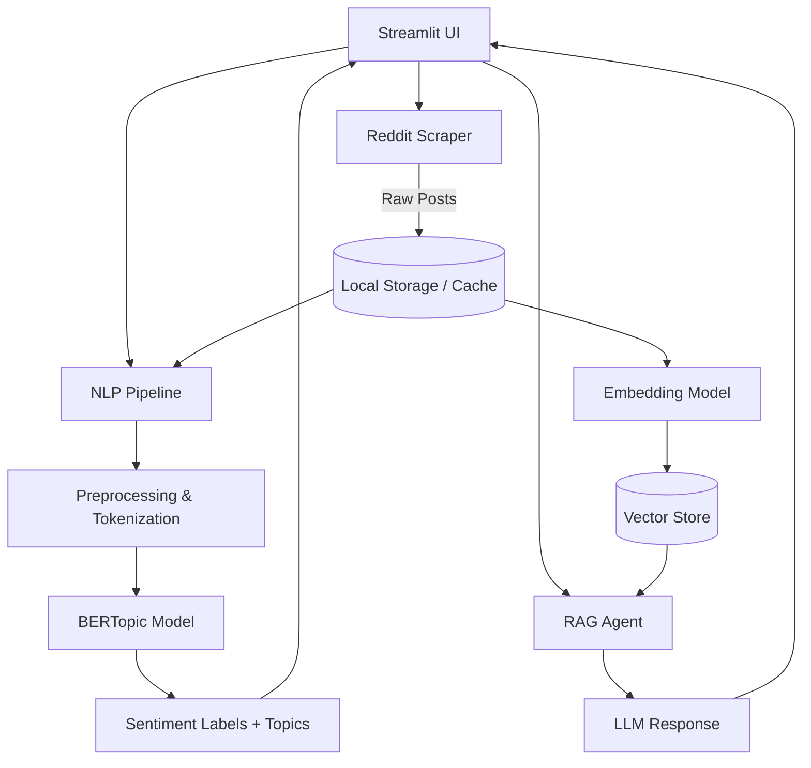

# WSB Sentiment Analysis & RAG Agent

A Streamlit application that ingests data from r/wallstreetbets, performs NLP-driven sentiment analysis with BERTopic, and provides a RAG-powered Q&A agent grounded in subreddit context.

---

## Setup and Installation

1. **Clone the repository** (if you haven't already) and navigate to the project folder:
   ```bash
   cd Wallstreetbets-sentiment-analysis-RAG-agent
   ```

2. **Create a virtual environment** (recommended):
   ```bash
   python -m venv venv
   # On Windows:
   venv\Scripts\activate
   # On macOS/Linux:
   source venv/bin/activate
   ```

3. **Install dependencies**:
   ```bash
   pip install -r requirements.txt
   ```

4. **Download the spaCy model**:
   Required for NLP preprocessing (lemmatization and stop-word removal):
   ```bash
   python -m spacy download en_core_web_sm
   ```

5. **Set up Environment Variables**:
   Copy the example environment file and fill in your details (if applicable):
   ```bash
   cp .env.example .env
   ```

---

## Running the Application

Once your setup is complete, you can launch the Streamlit application locally:

```bash
streamlit run app.py
```

The app will typically become available in your web browser at `http://localhost:8501`.

---

## Architecture Overview



---

## Project Structure

```
Wallstreetbets-sentiment-analysis-RAG-agent/
├── app.py                        # Streamlit entry point
├── requirements.txt
├── .env.example                  # Template for API keys
├── .gitignore
│
├── src/
│   ├── __init__.py
│   ├── scraper/
│   │   ├── __init__.py
│   │   └── reddit_scraper.py     # PRAW / PSAW scraping logic
│   │
│   ├── nlp/
│   │   ├── __init__.py
│   │   ├── preprocessing.py      # Text cleaning, tokenization
│   │   └── sentiment.py          # BERTopic + sentiment classification
│   │
│   ├── rag/
│   │   ├── __init__.py
│   │   ├── embeddings.py         # Document chunking & embedding
│   │   ├── vector_store.py       # ChromaDB / FAISS integration
│   │   └── agent.py              # LangChain RAG chain
│   │
│   └── utils/
│       ├── __init__.py
│       └── config.py             # Centralized env / settings
│
├── data/
│   └── .gitkeep                  # Cached scraped data (gitignored)
│
├── skills/                       # Skill files for each component
│   ├── reddit_scraping/SKILL.md
│   ├── nlp_preprocessing/SKILL.md
│   ├── bertopic_sentiment/SKILL.md
│   ├── rag_agent/SKILL.md
│   └── streamlit_app/SKILL.md
│
└── tests/
    ├── test_scraper.py
    ├── test_nlp.py
    └── test_rag.py
```

---

## Component Breakdown

### 1. Reddit Scraper (`src/scraper/`)

| Detail | Value |
|--------|-------|
| **Input** | `n` (number of posts), sort method (`hot`, `top`, `new`) |
| **Output** | DataFrame with columns: `title`, `selftext`, `score`, `num_comments`, `created_utc`, `author`, `url`, `flair` |
| **Caching** | Save to `data/wsb_posts_{timestamp}.parquet` to avoid redundant API calls |

### 2. NLP Preprocessing (`src/nlp/preprocessing.py`)

| Step | Description |
|------|-------------|
| Lowercasing | Normalize case |
| Emoji / special char handling | Decode emojis, strip markdown/URLs |
| Ticker extraction | Regex to pull `$TICKER` symbols |
| Stop-word removal | nltk or spaCy stop words |
| Lemmatization | spaCy `en_core_web_sm` |
| Combined text field | Merge `title` + `selftext` for downstream models |

### 3. BERTopic Sentiment Analysis (`src/nlp/sentiment.py`)

| Detail | Value |
|--------|-------|
| **Topic model** | `BERTopic` with sentence-transformer embeddings |
| **Sentiment classifier** | HuggingFace `transformers` pipeline (`finiteautomata/bertweet-base-sentiment-analysis` or similar financial sentiment model) |
| **Output** | Per-post: `topic_id`, `topic_label`, `sentiment_label`, `sentiment_score` |
| **Visualizations** | BERTopic's built-in `visualize_topics()`, `visualize_barchart()`, plus custom Plotly charts |

### 4. RAG Agent (`src/rag/`)

| Detail | Value |
|--------|-------|
| **Embeddings** | `sentence-transformers/all-MiniLM-L6-v2` (or OpenAI `text-embedding-3-small`) |
| **Vector store** | ChromaDB (lightweight, local-first) |
| **Framework** | LangChain `RetrievalQA` chain |
| **LLM** | OpenAI `gpt-4o-mini` (cost-effective) or local via `Ollama` |
| **Chunking** | `RecursiveCharacterTextSplitter` — 500 tokens, 50 overlap |
| **Prompt template** | System prompt grounding the model in WSB context |

### 5. Streamlit App (`app.py`)

| Page / Tab | Content |
|------------|---------|
| **🏠 Home** | Overview, scrape controls (select N, sort type) |
| **📊 Dashboard** | Sentiment distribution, topic clusters, trending tickers, time-series charts |
| **🔍 Explorer** | Searchable/filterable table of scraped posts with per-row sentiment |
| **🤖 Ask WSB** | RAG chat interface — user types a question, gets an answer grounded in scraped posts |

---

## Key Dependencies

```
streamlit
pandas
plotly
bertopic
sentence-transformers
transformers
torch
spacy
langchain
langchain-openai        # or langchain-community for Ollama
chromadb
python-dotenv
```

---
